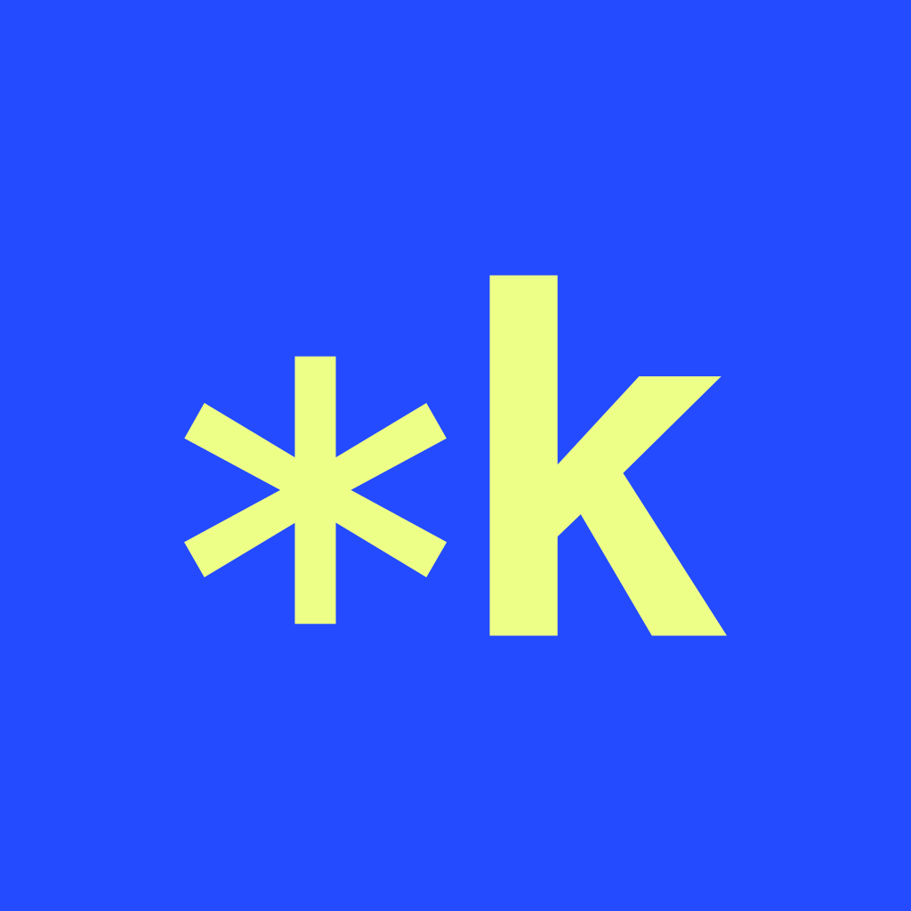

<p align="center">
  
</p>

<h1 align="center">Know Your Code</h1>

<p align="center"><strong>You vibe coded it. Now understand what you shipped.</strong></p>

<p align="center">A skill for Codex · Open source · MIT</p>

Your app works, but you want to understand what happens when someone uses it, why a bug keeps returning, or where to make the next change.

KYCode helps you work through those questions in your own project. It guides Codex to follow the actual code, explain the connections, and check its answers. You can explore a feature, investigate a problem, or build something while learning how it fits.

## Get started

Paste this into a Codex task:

```text
$skill-installer Install the skill from https://github.com/axis-ve/KYCode/tree/main/skills/know-your-code
```

Open the project you want to work on, then start with one question:

```text
$know-your-code What happens when I press Save? Follow it from the button to storage. Don't change anything yet.
```

Replace "Save" with an action from your app. Codex needs access to the project files. If the skill does not appear after installation, restart Codex.

## What to use it for

| You want to… | Ask KYCode to… |
| --- | --- |
| Understand a feature | Follow a user action through the code and data. |
| Investigate a bug | Check the symptom against the files, logs, and runtime behavior. |
| Make a change | Implement it, check the affected behavior, and explain where to edit it next. |
| Check your understanding | Ask one question about the code, wait for your answer, and explain what you missed. |

### Find out why something breaks

Describe what happened and what you expected:

```text
$know-your-code My edits disappear after a refresh. Find out why before proposing a fix.
```

KYCode should connect the symptom to evidence and explain how to check the cause. If the evidence is incomplete, it should say what is still unknown.

### Learn through a change you need

```text
$know-your-code Add a confirmation before deleting a document. Test it, then show me where I'd change the message.
```

You get help with the change and an explanation of the code you will maintain. Asking for an explanation keeps the work read-only; asking for a fix or feature lets Codex make that change.

## Set the pace

Say "less jargon," "go deeper," or "just fix it" as you go. You can take a detour and return to the feature you were exploring.

For practice, ask:

```text
Ask me one question about the code we just looked at. Wait for my answer before explaining.
```

Practice is optional. You can keep working without quizzes or a fixed lesson plan.

Prefer talking? Invoke the skill, then use voice in your Codex app if it supports it. Voice controls come from the app. Live voice testing for this skill is still pending.

## Installation options

<details>
<summary>Install for one project manually</summary>

1. [Download this repository](https://github.com/axis-ve/KYCode/archive/refs/heads/main.zip) and unzip it.
2. Create `.agents/skills/` in your project's root.
3. Copy the entire `skills/know-your-code` folder into that directory, including its license and `agents` folder.
4. Open your project in Codex and invoke `$know-your-code`.

The entry point must be at:

```text
your-project/.agents/skills/know-your-code/SKILL.md
```

</details>

<details>
<summary>Update or uninstall</summary>

For a manual installation, back up any local changes and replace the installed `know-your-code` folder with the latest copy. Remove that folder to uninstall.

If you used `$skill-installer`, ask Codex to locate the installed copy and update or remove it. The installer may refuse to overwrite an existing folder, so preserve your changes before replacing it.

</details>

The skill needs no separate server, API key, or npm installation. Learn more about [skills in Codex](https://developers.openai.com/codex/skills/).

## Contribute

Read the [skill instructions](skills/know-your-code/SKILL.md), try the [evaluation cases](evals/README.md), or follow the [contribution guide](CONTRIBUTING.md) to propose a change.

To report a problem, include your prompt, what you expected, and what happened. Remove private code and personal information before sharing.

## License

[MIT](LICENSE). KYCode is an independent project and is not affiliated with OpenAI.
